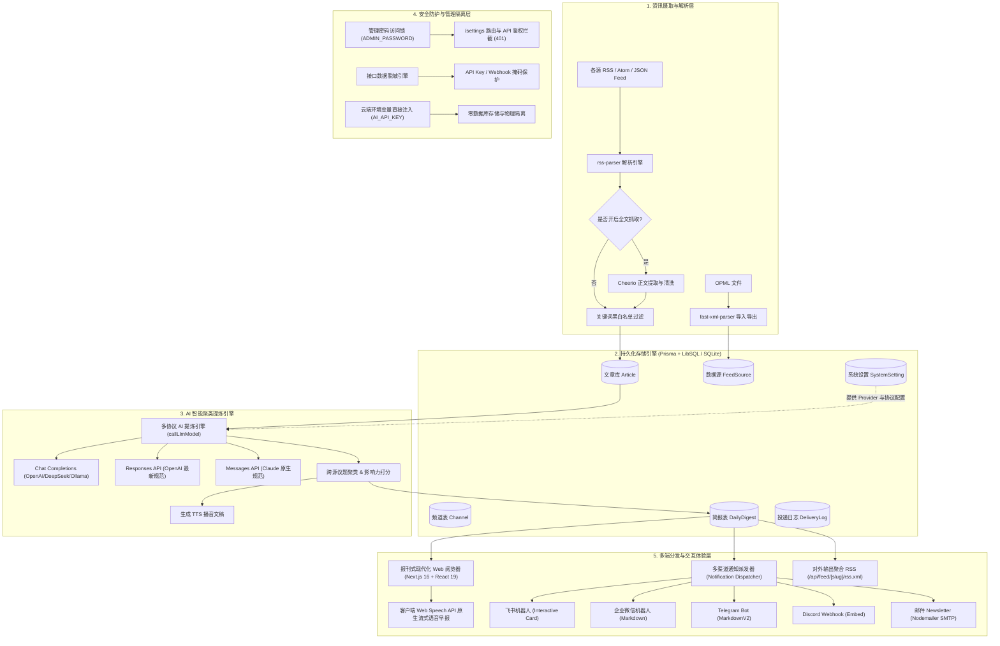

# Daily RSS Digest（每日 RSS 智汇晨报）

现代化、自托管、支持云端 Serverless 部署的每日多源 RSS 智能聚合、聚类提炼与多端触达平台。支持自定义多主题频道、关键词规则过滤、跨源降噪聚类、三协议 AI 提炼引擎（Chat Completions / Responses / Claude Messages）、语音早报（TTS）、OPML 批量迁移导入导出，以及飞书、企业微信、Telegram、Discord 和邮件 Newsletter 多渠道自动分发。

---

## 🏛️ 系统架构 (Architecture)



---

## 🛠️ 技术栈清单 (Tech Stack)

| 领域 | 核心选型 | 说明 |
|---|---|---|
| **全栈框架** | Next.js 16.2 (App Router) | 高性能前后端一体，React 19 Server & Client Components，原生集成 Turbopack |
| **语言与类型** | TypeScript 5 | 全链路严格类型保证，前后端同构类型定义 |
| **样式与设计** | Tailwind CSS v4 + Lucide Icons | 报刊杂志优雅排版，响应式移动端深度适配与无框架矢量设计 |
| **数据持久化** | Prisma ORM 6.19 + LibSQL / SQLite | 支持单文件本地存储 (`dev.db`) 或无缝切换 Turso Cloud Serverless 分布式数据库 |
| **RSS & 网页爬虫** | `rss-parser` + `cheerio` | 兼容 RSS 2.0 / Atom 1.0，正文智能提取、清洗与截断源深度抓取 |
| **OPML 处理** | `fast-xml-parser` | 支持从 Feedly、Follow、NetNewsWire 等主流阅读器无缝双向导入导出 |
| **多协议 AI 引擎** | 原生 Fetch 统一抽象 | 适配 **Chat Completions**（主流/DeepSeek）、**Responses**（OpenAI 最新）与 **Messages**（Claude 原生）|
| **音频体验** | Web Speech API | 零第三方延迟、浏览器原生流式语音播报，支持播放/暂停/文稿联播 |
| **通知派发** | Webhook + `nodemailer` | 原生接入飞书富文本卡片、企业微信、Telegram、Discord 与 SMTP 邮件 |
| **聚合分发** | `feed` | 将提炼后的晨报输出为标准聚合 RSS 2.0，供第三方阅读器反向订阅 |
| **云端部署** | Netlify + Turso | 标准 Netlify Functions / Next.js Serverless 架构，开箱即用 |

---

## ⏱️ 核心业务时序图 (Daily Digest Lifecycle)

```mermaid
sequenceDiagram
    autonumber
    actor User as 用户 / 定时任务 (Cron)
    participant API as Next.js API (/api/digests)
    participant Engine as 晨报生成引擎 (Digest Generator)
    participant RSS as RSS 源站点
    participant DB as LibSQL / SQLite (Prisma)
    participant AI as AI 多协议提炼引擎
    participant Push as 消息派发 (Webhook / Email)

    User->>API: 触发生成晨报 (手动触发或定时 Cron)
    API->>Engine: 调用 generateDailyDigestForChannel(channelId, date)
    Engine->>DB: 查询当前频道关联的 RSS 源与关键词过滤规则
    loop 遍历频道订阅源
        Engine->>RSS: 抓取最新 Feed XML
        RSS-->>Engine: 返回文章列表
        alt 开启正文抓取
            Engine->>RSS: HTTP 请求抓取文章 HTML 并用 Cheerio 清洗正文
        end
        Engine->>DB: 留存文章记录并执行关键词黑白名单过滤
    end
    Engine->>AI: 提交文章候选集，根据频道 Prompt 进行跨源聚类与 TL;DR 提炼
    AI-->>Engine: 返回聚合议题、影响力评分、深度洞察与 TTS 语音文稿
    Engine->>DB: Upsert 存储当日 DailyDigest
    Engine->>Push: 派发飞书 / 企微 / Telegram / Discord / 邮件通知
    Push-->>Engine: 写入 DeliveryLog 投递日志
    Engine-->>API: 返回最新排版的完整晨报数据
    API-->>User: 前端报刊视图实时渲染并就绪语音早报播放
```

---

## 🗄️ 数据模型表 (Database Schema)

| 数据表 | 字段 | 类型 | 说明 |
|---|---|---|---|
| `Channel` | `id`, `name`, `slug`, `description`, `icon`, `scheduleTime`, `promptTemplate`, `filterKeywords`, `isEnabled` | String / Boolean | 频道主题与规则定制表（包含个性化 Prompt 规则与过滤词） |
| `FeedSource` | `id`, `channelId`, `title`, `url`, `siteUrl`, `isFullTextFetch`, `lastFetchedAt`, `status`, `lastError` | String / DateTime / Boolean | RSS 订阅源信息与运行健康状态 |
| `Article` | `id`, `feedSourceId`, `title`, `link`, `author`, `publishedAt`, `summarySnippet`, `fullContent` | String / DateTime | 抓取到的原始文章快照缓存表 |
| `DailyDigest` | `id`, `channelId`, `date`, `title`, `overview`, `sectionsJson`, `rawAiOutput`, `audioText`, `articleCount`, `status` | String / Int | 每日智能晨报聚合数据（复合唯一键：`channelId` + `date`） |
| `SystemSetting` | `key`, `value`, `description`, `updatedAt` | String / DateTime | 全局 AI Provider、协议规范、密钥与 Webhook/SMTP 推送配置 |
| `DeliveryLog` | `id`, `digestId`, `targetType`, `targetDestination`, `status`, `message`, `sentAt` | String / DateTime | 多渠道通知推送记录与投递日志 |

---

## 🔒 安全防护机制 (Security Architecture)

为了杜绝云端部署时 API Key 等核心机密发生泄露，系统构建了**三重防泄露安全屏障**：

### 1. 访问控制：设置中心管理密码锁 (`ADMIN_PASSWORD`)
- 在环境变量中设置 `ADMIN_PASSWORD` 后，访问 `/settings` 会立即激活管理验证锁屏卡片。
- 未输入密码的访客无法查看或修改任何配置；调用 `/api/settings` 和 `/api/test-ai` 会被后端直接拦截并返回 `HTTP 401 Unauthorized`。
- 验证成功后通过 HttpOnly Cookie（`admin_session`，30 天免密）维持鉴权，支持随时一键注销锁定。

### 2. 接口脱敏：API Key 与 Webhook 永不暴露明文
- 调用 `GET /api/settings` 获取配置时，服务端自动进行掩码脱敏处理（例如：`sk-c••••••••a5wn`）。
- 浏览器网络 DevTools、抓包工具或第三方插件无法获取真实密钥字符串。
- 连通性测试接口（`POST /api/test-ai`）支持自动识别脱敏占位符，由服务端在底层直接调用存储的密钥进行探测，无需前端传回明文。

### 3. 架构隔离：云端 Serverless 环境变量直接注入 (`AI_API_KEY`)
- 支持在 Netlify 或 Vercel 等平台的环境变量中直接注入 `AI_API_KEY`。
- 此时系统进入**物理隔离模式**：API Key 永远不写入数据库，由云端运行时统一托管，前端显示 `🔒 云端环境变量已注入 (安全防泄露)` 并自动锁定输入框。

---

## 🚀 环境搭建与快速开始 (Getting Started)

### 1. 克隆与安装依赖

```bash
git clone <your-repo-url>
cd daily-rss-digest

# 安装 Node 依赖
npm install
```

### 2. 配置环境变量 (`.env`)

复制环境配置模板：

```bash
cp .env.example .env
```

根据您的运行环境选择以下配置方案：

#### 方案 A：本地开发模式（基于本地单文件 SQLite）

```env
# 留空 TURSO 变量即自动回退至本地 SQLite
TURSO_DATABASE_URL=""
TURSO_AUTH_TOKEN=""

# 管理员安全访问密码（留空则不开启访问锁）
ADMIN_PASSWORD="your_admin_secret_password"

# 定时任务安全调用秘钥
CRON_SECRET="rss_digest_secret_key_2026"
```

#### 方案 B：云端与生产模式（基于 Turso Cloud LibSQL）

```env
TURSO_DATABASE_URL="libsql://your-db-name.turso.io"
TURSO_AUTH_TOKEN="your_turso_jwt_token"

ADMIN_PASSWORD="your_strong_admin_password"
AI_API_KEY="sk-your-ai-api-key"
CRON_SECRET="your_production_cron_secret"
```

### 3. 初始化数据库结构与种子数据

```bash
# 自动根据环境（本地 SQLite 或 Turso Cloud）推送表结构
npm run prisma:push

# 注入默认精品科技频道、精选热门 RSS 源与演示晨报
npm run db:seed
```

### 4. 启动本地开发服务

```bash
npm run dev
```

在浏览器打开 [http://localhost:3000](http://localhost:3000)，即可体验杂志级晨报排版与语音早报。

### 5. 编译与运行生产版本

```bash
npm run build
npm run start
```

---

## ☁️ 他人 Fork 本项目快速部署与配置指南 (Fork & Self-Hosting Guide)

本项目完全支持零成本（100% 免费）一键 Fork 自托管。底层采用 **Turso 云数据库（免费 9GB） + Netlify Serverless 静态与前端托管 + GitHub Actions 自动化定时任务** 架构。

### 步骤 1：Fork 本仓库
点击 GitHub 页面右上角 **Fork** 按钮，将本项目完整复制一份到您的个人 GitHub 账号下。

### 步骤 2：创建免费 Turso 云数据库
1. 前往 [Turso 官网](https://turso.tech) 注册账号（免费版提供 9GB 存储，足可容纳数十万篇资讯）：
   ```bash
   # 创建专属数据库
   turso db create daily-rss-digest
   # 获取数据库连接 URL（以 libsql:// 开头）
   turso db show daily-rss-digest --url
   # 创建访问 Token
   turso db tokens create daily-rss-digest
   ```
2. 初始化表结构并导入预设频道与热门订阅源（在本地命令行执行一次即可）：
   ```bash
   TURSO_DATABASE_URL="libsql://your-db.turso.io" TURSO_AUTH_TOKEN="your_token" npm run prisma:push
   TURSO_DATABASE_URL="libsql://your-db.turso.io" TURSO_AUTH_TOKEN="your_token" npm run db:seed
   ```

### 步骤 3：导入 Netlify 进行前端一键托管
1. 登录 [Netlify 控制台](https://app.netlify.com)，点击 **Add new site** -> **Import an existing project**。
2. 授权并选择您刚 Fork 的 `daily-rss-digest` 仓库，Netlify 会自动识别根目录的 [`netlify.toml`](./netlify.toml)。
3. 进入 **Site configuration** -> **Environment variables**，配置生产环境变量：
   | 环境变量名 | 必填 | 说明 |
   |---|:---:|---|
   | `TURSO_DATABASE_URL` | 是 | 步骤 2 中获取的 `libsql://...` 数据库地址 |
   | `TURSO_AUTH_TOKEN` | 是 | 步骤 2 中生成的 Turso JWT Token |
   | `ADMIN_PASSWORD` | 是 | 访问 `/settings` 设置中心的管理密码（如 `my_password_2026`） |
   | `AI_API_KEY` | 可选 | 云端直接注入大模型密钥（也可部署后在 Web 设置中心配置） |
4. 点击 **Deploy**，部署完成后即可获得 Netlify 专属在线域名（例如 `https://your-app.netlify.app`）。

### 步骤 4：在 GitHub 仓库配置 Actions 密钥（实现每日 08:00 定时晨报与推送）
为彻底规避 Serverless 平台的执行时长截断，晨报生成由内置的 GitHub Actions 自动化流水线负责：
1. 打开您 Fork 的 GitHub 仓库，进入 **Settings** -> **Secrets and variables** -> **Actions**。
2. 点击 **New repository secret**，添加以下密钥：
   - `TURSO_DATABASE_URL`：同步骤 2 中的 Turso 连接地址
   - `TURSO_AUTH_TOKEN`：同步骤 2 中的 Turso Token
   - `BASE_URL`：步骤 3 中 Netlify 分配的正式线上域名（如 `https://your-app.netlify.app`，用于通知卡片跳转）
   - `AI_API_KEY`：（可选）若未在 Web 设置中心保存，可直接在此注入
3. **自动化运作**：每天北京时间早晨 **08:00**（UTC 00:00），GitHub Actions 会全自动爬取资讯源、调用大模型提炼晨报并同步派发至多端！随时也可在 GitHub 仓库的 **Actions** 标签页点击 **Run workflow** 手动触发即刻生成。

---

## 📲 多端推送配置与使用指南 (Push Notifications Guide)

每日晨报在早晨 08:00 生成完毕后，系统将**立即自动通过消息通道派发至已启用的多端客户端**。访问线上站点的 `/settings`（设置中心 ➔ 推送设置）即可随时配置与一键测试。

### 1. 飞书机器人 (Feishu Bot)
* **配置步骤**：
  1. 在飞书群组中，点击右上角「设置」➔「群机器人」➔「添加自定义机器人」；
  2. 复制生成的 Webhook 地址（格式形如 `https://open.feishu.cn/open-apis/bot/v2/hook/...`）；
  3. 在 Web 设置中心勾选 **启用飞书推送** 并粘贴 Webhook 地址，保存即可。
* **卡片形态**：定制交互式富文本卡片（CardKit），包含早报主标题、今日全局总览 TL;DR、各焦点议题深度解析及「阅读完整排版晨报」一键跳转按钮。

### 2. 企业微信机器人 (WeCom Bot)
* **配置步骤**：
  1. 在企业微信群聊中点击右上角「...」➔「添加群机器人」➔ 新建自定义机器人；
  2. 复制生成的 Webhook 地址（以 `https://qyapi.weixin.qq.com/cgi-bin/webhook/send?key=...` 开头）；
  3. 在 Web 设置中心勾选 **启用企业微信推送** 并填入 Webhook。
* **卡片形态**：原生 Markdown 精简排版，清晰罗列今日各焦点议题要点速览与原文来源。

### 3. Telegram 机器人 (Telegram Bot)
* **配置步骤**：
  1. 在 Telegram 中私聊官方账号 `@BotFather`，发送 `/newbot` 指令，按照指引获取 **Bot Token**；
  2. 将创建好的机器人拉入您的通知群组或频道；
  3. 搜索 `@userinfobot` 获取接收者（个人或群组）的 **Chat ID**（群组 Chat ID 通常为负数）；
  4. 在 Web 设置中心填入 `Bot Token` 和 `Chat ID`，并勾选启用。
* **卡片形态**：标准 MarkdownV2 格式消息，支持粗体高亮与超链接跳转。

### 4. Discord 频道 Webhook
* **配置步骤**：
  1. 在 Discord 服务器中选择目标文字频道，点击「编辑频道」➔「整合 (Integrations)」➔「Webhooks」；
  2. 点击「创建 Webhook」，自定义机器人昵称并复制 Webhook URL；
  3. 在 Web 设置中心勾选 **启用 Discord 推送** 并粘贴 URL。
* **卡片形态**：高对比度深色 Embed 富文本嵌入卡片，支持多字段结构化排版。

### 5. 邮件 Newsletter (SMTP 邮件直投)
* **配置步骤**：
  1. 准备任意支持 SMTP 的邮箱（如 QQ邮箱、163邮箱、Gmail 或企业域名邮箱、Resend、SendGrid）；
  2. 获取 SMTP 主机名、端口（推荐 `465` SSL 或 `587` TLS）、发信账号以及**授权码 / 应用专用密码**；
  3. 在收件人列表（`emailRecipients`）中填入接收邮箱，支持多个邮箱用英文逗号 `,` 分隔。
* **卡片形态**：纯正报刊杂志排版 HTML 格式邮件，在移动端与桌面端邮件客户端均能获得舒适的晨报阅读体验。

### 6. 一键连通性测试与自动化联动
* **实时测试**：在 Web 设置中心配置好各渠道后，无需等待早晨 08:00，点击底部的 **「发送测试通知」** 按钮，系统会立即向所有已勾选的渠道发送测试卡片，实时校验网络与凭据有效性。
* **定时联动**：每天早晨 08:00 晨报生成完毕后，系统自动通过 `dispatchDigestNotifications` 瞬时并发推送至所有已开启渠道。

---

## 📡 核心 API 清单 (API Reference)

### 1. 安全鉴权接口 (`/api/auth`)
- `GET /api/auth`：查询系统是否启用了管理员密码及当前用户是否已登录。
- `POST /api/auth`：校验管理员密码，成功后写入 HttpOnly 安全 Cookie。
- `DELETE /api/auth`：退出登录，销毁当前管理会话。

### 2. 晨报聚合接口 (`/api/digests`)
- `GET /api/digests?channelId={id}&date={YYYY-MM-DD}`：查询指定频道与日期的完整排版数据。
- `GET /api/digests?channelId={id}&listHistory=true`：获取该频道往期历史晨报归档列表。
- `POST /api/digests`：手动触发即时抓取并生成今日晨报：
  ```json
  { "channelId": "channel_id_here", "date": "2026-09-10" }
  ```

### 3. 订阅源与 OPML 接口 (`/api/feeds`)
- `GET /api/feeds`：获取所有登记订阅源列表及其抓取健康状态。
- `POST /api/feeds`：添加新订阅源或执行单源连通性探测（`previewOnly: true`）。
- `PUT /api/feeds`：更新订阅源属性或更换归属频道。
- `DELETE /api/feeds?id={id}`：删除指定订阅源。
- `GET /api/feeds/opml`：一键导出所有频道与源为标准 `.opml` 文件。
- `POST /api/feeds/opml`：批量导入 OPML 文件，自动去重并挂载至指定频道。

### 4. 频道定制接口 (`/api/channels`)
- `GET /api/channels`：获取所有频道信息、挂载源列表及统计数据。
- `POST /api/channels`：新建频道（支持绑定源列表 `sourceIds`、配置专属 Prompt 与过滤词）。
- `PUT /api/channels`：修改频道规则、更新绑定订阅源集合。
- `DELETE /api/channels?id={id}`：删除频道。

### 5. AI 提炼引擎与系统配置 (`/api/settings` / `/api/test-ai`)
- `GET /api/settings`：获取当前系统配置（受管理密码保护，敏感密钥全量脱敏返回）。
- `POST /api/settings`：保存 AI Provider、接口协议及多渠道推送 Webhook 配置。
- `POST /api/test-ai`：实时探测目标 AI 接口连通性、网络延迟与协议兼容性。

### 6. 多端通知测试接口 (`/api/test-notify`)
- `POST /api/test-notify`：向飞书、企微、Telegram、Discord 或 SMTP 邮件发送测试卡片。

### 7. 对外聚合输出 RSS
- `GET /api/feed/[slug]/rss.xml`：输出标准 RSS 2.0 格式订阅源，支持直接填入外部阅读器或播客客户端反向订阅。

### 8. 定时自动触发任务接口 (`/api/cron/digest`)
- `GET /api/cron/digest?key={CRON_SECRET}` 或请求头携带 `Authorization: Bearer {CRON_SECRET}`：
  触发全局激活频道的晨报生成与全渠道推送任务。

---

## ⏰ 定时调度配置指南 (Cron Automation)

推荐设置每日上午 08:00 准时自动触发晨报生成与多端推送：

### 推荐方案：内置 GitHub Actions 自动化工作流（首选，无超时风险）
项目已内置 [`.github/workflows/daily-digest.yml`](./.github/workflows/daily-digest.yml)，在 GitHub Secrets 中配置 `TURSO_DATABASE_URL` 与 `TURSO_AUTH_TOKEN` 后即可开箱生效：
* **触发频率**：每天北京时间早晨 **08:00**（UTC 00:00）全自动运行；
* **优势**：拥有 15 分钟充足运行窗口，直连 Turso 数据库完成全网抓取、大模型深度提炼与多端通知推送，彻底规避 Serverless 平台 10 秒超时限制。

### 备选方案：通过外部定时发令枪调用 `/api/cron/digest`
若将项目部署在常驻 Node.js 服务器或容器中，也可通过接口密钥触发：
* **Linux crontab 示例**：
  ```bash
  # 每日早上 08:00 自动触发生成与分发
  0 8 * * * curl -s -X GET "https://your-domain.com/api/cron/digest?key=your_production_cron_secret" > /dev/null 2>&1
  ```
* **第三方云端 Cron 服务**：
  在 [cron-job.org](https://cron-job.org) 中创建定时任务，填写目标 URL 为 `https://your-site.netlify.app/api/cron/digest?key=your_production_cron_secret`，设定在每日早晨定时发起 GET 请求。
